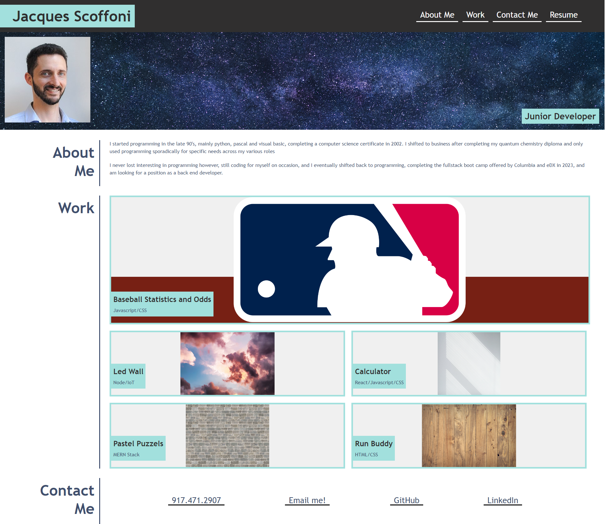

# JS Portfolio

## Description
Week 2 assignment, making a personal portfolio page using basic html and css.

## User Story
```
AS AN employer
I WANT to view a potential employee's deployed portfolio of work samples
SO THAT I can review samples of their work and assess whether they're a good candidate for an open position
```

## Screenshot

## License
All pictures used are free of use, found on pexels.com. 

## Personal Notes
I struggled a bit with the distinction between using block or flex but was able to circle back and fix things.
The hover function works, but since I have a full image on most of the buttons, it only shows on my personal project.
